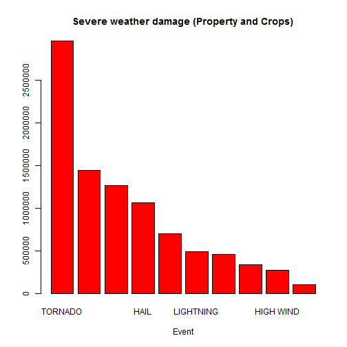

# Severe Weather Events in the USA

## Synopsis

In this document the NOAA Storm Database is explored to understand the severe weather events in the USA and its economic consequences.

## Data Processing

Data for this document is taken from NOAA Storm Database available from https://d396qusza40orc.cloudfront.net/repdata%2Fdata%2FStormData.csv.bz2
**readData()** function is used to read data from the website 


```r
library(lattice)

readData <- function(){
#====================================
#This function returns data required 
#==================================== 
  #download data from URL
  dataFileURL <- "http://d396qusza40orc.cloudfront.net/repdata%2Fdata%2FStormData.csv.bz2"
  #https://d396qusza40orc.cloudfront.net/repdata%2Fdata%2FStormData.csv.bz2
  #I am using Windows so https is removed and replaced with http curl does not work in my machine
  if (!file.exists(".\\data")){dir.create(".\\data")}#if there is no directory called data create one
  #now store downloaded file in data directory
  download.file(dataFileURL, destfile = ".\\data\\StormData.csv.bz2", mode ="wb")
  #mode set to "wb" because this is binary data
  #we do not need to use unzip as read.table and read.csv can directly read compressed files
 				
  ### READING data  
  stormData <- read.csv(".\\data\\StormData.csv.bz2", header = TRUE)
  stormData
}

stormData <- readData()
```
On my copy of the data downloaded on 22/06/2015, number of rows and columns are as follows:

Number of rows -

```r
nrow(stormData)
```

```
## [1] 902297
```
Number of columns -

```r
ncol(stormData)
```

```
## [1] 37
```
There are various sever weather types identified by this dataset, to be precise there are 

```r
events <-unique(stormData$EVTYPE)
nrow(events)
```

```
## NULL
```
unique sever weather types identified.

### Severe weather affecting population health
In exploring severe weather and its affect on population health I am first looking at event type and the number of fatalities.


```r
a <- aggregate(stormData$FATALITIES, by = list(stormData$EVTYPE), FUN = sum)
colnames (a) <- c("EVTYPE","TotalFatalities")
#sort by Fatalities (descending)
newdata <- a[order(-a$TotalFatalities),]
#remove non fatal events
n <-newdata[newdata$TotalFatalities > 0,]
colnames (n) <- c("EVTYPE","TotalFatalities")
```
The highest fatalities caused by sever weather are given below (only the events that caused more than 100 fatalities are presented)


```r
n[n$TotalFatalities >99,]
```

```
##                      EVTYPE TotalFatalities
## 834                 TORNADO            5633
## 130          EXCESSIVE HEAT            1903
## 153             FLASH FLOOD             978
## 275                    HEAT             937
## 464               LIGHTNING             816
## 856               TSTM WIND             504
## 170                   FLOOD             470
## 585             RIP CURRENT             368
## 359               HIGH WIND             248
## 19                AVALANCHE             224
## 972            WINTER STORM             206
## 586            RIP CURRENTS             204
## 278               HEAT WAVE             172
## 140            EXTREME COLD             160
## 760       THUNDERSTORM WIND             133
## 310              HEAVY SNOW             127
## 141 EXTREME COLD/WIND CHILL             125
## 676             STRONG WIND             103
## 30                 BLIZZARD             101
## 350               HIGH SURF             101
```
Below graph shows the top 5 sever weather events that causes high risk to life in the US


```r
top <- n[1:5,]
events <- top$EVTYPE
barplot(top$TotalFatalities, main = "Sever weather events and fatalities in the US", names.arg = events, col = "blue")
```

 
Below we look at sever weather and injuries

```r
ain <- aggregate(stormData$INJURIES, by = list(stormData$EVTYPE), FUN = sum)
colnames (ain) <- c("EVTYPE","totalInjuries")
#sort by INJURIES (descending)
newdatain <- ain[order(-ain$totalInjuries),]
#remove non injury events
nin <-newdatain[newdatain$totalInjuries > 0,]
colnames (nin) <- c("EVTYPE","totalInjuries")
```
The highest injuries caused by sever weather are given below (only the events that caused more than 100 injuries are presented)


```r
nin[nin$totalInjuries >99,]
```

```
##                 EVTYPE totalInjuries
## 834            TORNADO         91346
## 856          TSTM WIND          6957
## 170              FLOOD          6789
## 130     EXCESSIVE HEAT          6525
## 464          LIGHTNING          5230
## 275               HEAT          2100
## 427          ICE STORM          1975
## 153        FLASH FLOOD          1777
## 760  THUNDERSTORM WIND          1488
## 244               HAIL          1361
## 972       WINTER STORM          1321
## 411  HURRICANE/TYPHOON          1275
## 359          HIGH WIND          1137
## 310         HEAVY SNOW          1021
## 957           WILDFIRE           911
## 786 THUNDERSTORM WINDS           908
## 30            BLIZZARD           805
## 188                FOG           734
## 955   WILD/FOREST FIRE           545
## 117         DUST STORM           440
## 978     WINTER WEATHER           398
## 89           DENSE FOG           342
## 848     TROPICAL STORM           340
## 278          HEAT WAVE           309
## 376         HIGH WINDS           302
## 586       RIP CURRENTS           297
## 676        STRONG WIND           280
## 290         HEAVY RAIN           251
## 585        RIP CURRENT           232
## 140       EXTREME COLD           231
## 222              GLAZE           216
## 19           AVALANCHE           170
## 142       EXTREME HEAT           155
## 350          HIGH SURF           152
## 954         WILD FIRES           150
## 417                ICE           137
## 877            TSUNAMI           129
```
Below graph shows the top 5 sever weather events that causes high risk to injuries/health in the US


```r
topin <- nin[1:5,]
events <- topin$EVTYPE
barplot(topin$totalInjuries, main = "Sever weather events and injuries in the US", names.arg = events, col = "red")
```

 


### Economic consequences of Severe Weather

In looking at economic consequences we observe crop damage and property damage caused by severe weather events in the USA


```r
subsetStorm <- stormData[c(8,25,27)]
names(subsetStorm) <- c("EVTYPE","PROPDMG","CROPDMG")
property<-aggregate(subsetStorm$PROPDMG,by = list (subsetStorm$EVTYPE), FUN = sum)
colnames(property) <- c("Event","PropertyDamage")
crop <- aggregate(subsetStorm$CROPDMG,by = list (subsetStorm$EVTYPE), FUN = sum)
colnames(crop) <- c("Event","CropDamage")

crop$PropertyDamage <- property$PropertyDamage
crop$TotalDamage <-rowSums(crop[,c("PropertyDamage","CropDamage")])
#order 
ordered <- crop[order(-crop$TotalDamage),]
total <- ordered[1:10,]

barplot(total$TotalDamage, main="Severe weather damage (Property and Crops)",
  xlab="Event", col=c("red"),  names.arg = total$Event)
```

 


## Resutlts

Above analysis showed that Tornados cause the highest fatalities and injuries in the USA. Therefore the importance of managing severe weather condition Tornados is highlighted.


